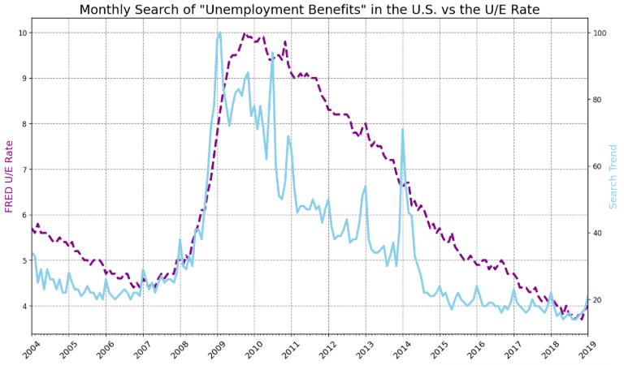
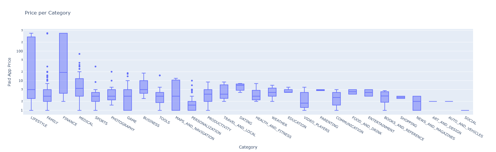
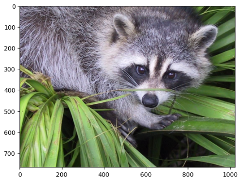

# Data Science

Here are my data analytics related works.\
This is the data science block from "100 days of python bootcamp" course.

## Projects
1. **Data Exploration With Pandas:** Use `.head()`, `.tail()`, `.shape` and `.columns` to explore a DataFrame and find out the number of rows and columns as well as the column names. Look for NaN (not a number) values with `.findna()` and consider using `.dropna()` to clean up a DataFrame. Aaccess entire columns of a DataFrame using the square bracket notation: `df['column name']`, as well as access individual cells in a DataFrame by chaining square brackets `df['column name'][index]` or using `df['column name'].loc[index]`. The largest and smallest values, as well as their positions, can be found with methods like `.max()`, `.min()`, `.idxmax()` and `.idxmin()`. Sort the DataFrame with `.sort_values()` and add new columns with `.insert()`. Create an Excel Style Pivot Table by grouping entries that belong to a particular category use the `.groupby()` method.
[a relative link](day-72-data-exploration-with-pandas/day-72.ipynb)

3. **Data Aggregate and Merge Data With Pandas:** Diving deep into a dataset all about LEGO. Keep learning `pandas` module, combine the `.groupby()` and `.count()` functions to aggregate data, use the `.value_counts()` function, create a scatter plot in Matplotlib, work with tables in a relational database by using primary and foreign keys, `.merge()` DataFrames along a particular column, create a bar chart with Matplotlib.\
[Google Colab](https://drive.google.com/file/d/1ZVT9KstPPsCWI6Y9OcDD8YaoKn8v_Xyg/view?usp=sharing)

4. **Resampling and Visualising Time Series:** Learned `.describe()` to quickly see some descriptive statistics at a glance, `.resample()` to make a time-series data comparable to another by changing the periodicity. Looked how to work with `matplotlib.dates` Locators to better style a timeline (e.g., an axis on a chart). Found out how to find the number of NaN values with `.isna().values.sum()`. Fine-tuning the styling of `Matplotlib` charts by using limits, labels, line width and colours.\
\
[Google Colab](https://drive.google.com/file/d/1s83Us10ozZxhwaYB2okfr5p0etMt6f3G/view?usp=sharing)

5. **Beautiful Plotly Charts and Analysing Android App Store:** Pull a random sample from a DataFrame using `.sample()`, find duplicate entries with `.duplicated()` and `.drop_duplicates()`, convert string and object data types into numbers with `.to_numeric()`. Use plotly to generate beautiful pie, donut, and bar charts as well as box and scatter plots.\
\
[Google Colab](https://drive.google.com/file/d/1jyYRfTStSZg58NeSJd3NWqEoNbb1TaRb/view?usp=sharing)

6. **Computation with NumPy and N-Dimensional Arrays:** Create arrays manually with `np.array()` as well as generate arrays using  `.arange()`, `.random()`, and `.linspace()`. Analyse the shape and dimensions of a ndarray, slice and subset a ndarray based on its indices. Do linear algebra like operations with scalars and matrix multiplication, use NumPys broadcasting to make ndarray shapes compatible. And the most exciting - manipulate images in the form of ndarrays.\
\
[Google Colab](https://drive.google.com/file/d/1yLLgztHooQzlBrn8SvJT3C1ZTVfNNwsJ/view?usp=sharing)
